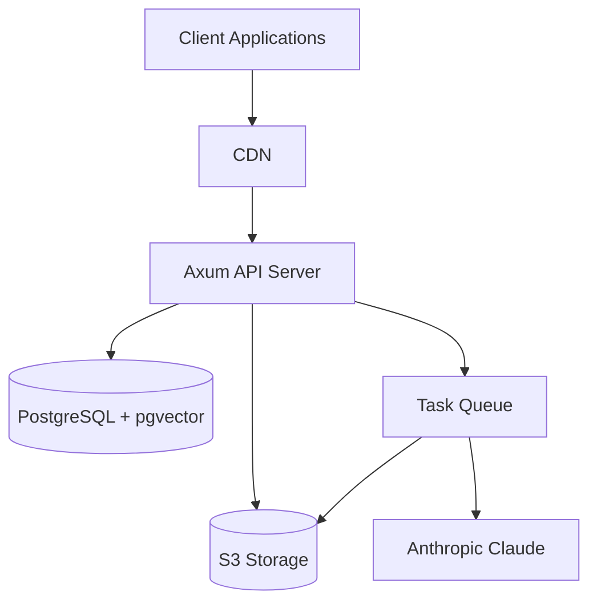
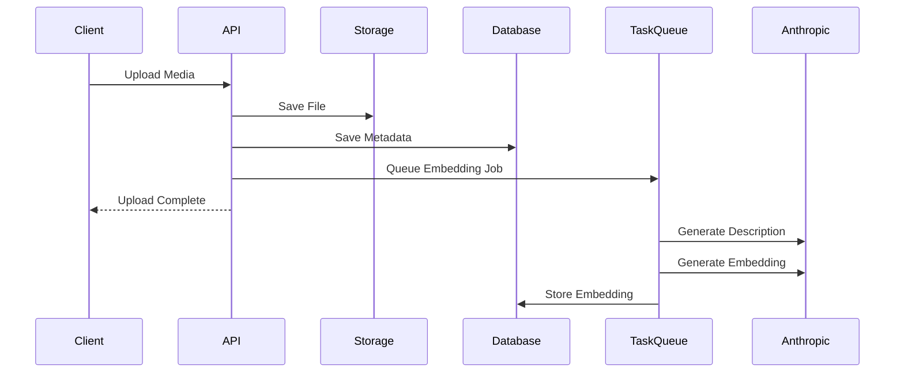
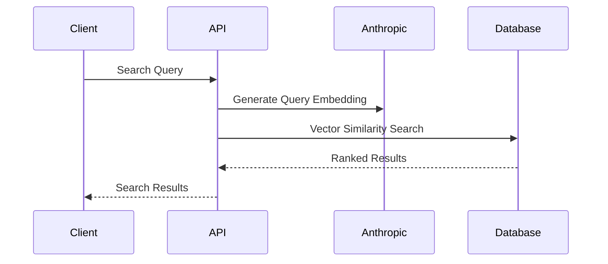

# Architecture

System design and technical architecture of Mindia.

## Overview

Mindia is a multi-tenant media management service built with Rust, using Axum for the web framework, PostgreSQL with pgvector for data/search, and S3 for object storage.

## High-Level Architecture

## Crate Architecture

Mindia is organized as a multi-crate workspace for better separation of concerns and faster compilation:

### Core Crates

- **mindia-core**: Domain models, types, error types, configuration
- **mindia-db**: Database repositories with tenant isolation
- **mindia-services**: External service clients (S3, Anthropic/Claude, ClamAV)
- **mindia-storage**: Storage abstraction layer (S3, local filesystem)
- **mindia-processing**: Media processing logic (images, video, audio, documents)
- **mindia-infra**: Shared infrastructure (middleware, telemetry, webhooks, analytics, rate limiting, cleanup)
- **mindia-worker**: Background task queue with LISTEN/NOTIFY, worker pool, retry logic

### Service Crates

- **mindia-api**: Main API service (HTTP handlers, business logic, task handlers)
- **mindia-cli**: Command-line tools
- **mindia-mcp**: Model Context Protocol server

### Plugin System

- **mindia-plugins**: Plugin implementations (e.g., AssemblyAI transcription, AWS Rekognition)

## Component Architecture

### 1. Web Layer (Axum)

- **Location**: `mindia-api/src/main.rs`, `mindia-api/src/handlers/`
- **Purpose**: HTTP request handling and routing
- **Features**:
  - JWT authentication middleware
  - CORS handling
  - Request logging
  - OpenTelemetry instrumentation

### 2. Business Logic (Services)

- **Location**: `mindia-api/src/services/`
- **Components**:
  - **Upload Service**: File upload processing
  - **Usage Service**: Usage tracking and limits
- **External Services** (`mindia-services`):
  - **Anthropic (Claude)**: Embedding generation, vision descriptions
  - **S3 Service**: Object storage operations

### 3. Data Layer (Repositories)

- **Location**: `mindia-db/src/db/`
- **Pattern**: Repository pattern for data access
- **Features**:
  - Connection pooling
  - Prepared statements
  - Tenant isolation

### 4. Storage Layer

- **Location**: `mindia-storage/src/`
- **Backends**:
  - **S3**: AWS S3 or compatible
  - **Local**: Filesystem storage
  - **Factory Pattern**: Pluggable storage backends

### 5. Media Processing

- **Location**: `mindia-processing/src/`
- **Components**:
  - Image processing and validation
  - Video transcoding with FFmpeg
  - Audio processing
  - Document processing
  - Image transformations and filters

### 6. Infrastructure

- **Location**: `mindia-infra/src/`
- **Components**:
  - Middleware (request ID, security headers, CSRF)
  - Telemetry (OpenTelemetry setup)
  - Webhook delivery with retry logic
  - Analytics collection
  - Rate limiting (sharded, sliding window)
  - Cleanup services (media files, old tasks)
  - Capacity checking (disk, memory, CPU)
  - Archive creation (ZIP, TAR)

### 7. Background Task Queue

- **Location**: `mindia-worker/src/`
- **Purpose**: PostgreSQL-backed task queue for async processing
- **Features**:
  - Worker pool with configurable concurrency
  - PostgreSQL LISTEN/NOTIFY for instant task notifications
  - Automatic retry with exponential backoff
  - Task dependencies and scheduling
  - Timeout handling
  - Per-task-type rate limiting
  - Task cleanup/archiving

### 8. Task Handlers

- **Location**: `mindia-api/src/task_handlers/`
- **Purpose**: Business logic for background jobs
- **Handlers**:
  - Video transcoding (HLS generation)
  - Embedding generation (semantic search)
  - Plugin execution (AI integrations)
  - Content moderation (AWS Rekognition)

## Data Flow

### Upload Flow

### Search Flow

## Multi-Tenancy

**Isolation Method**: Logical isolation with tenant_id filtering

**Key Points**:
- All tables include `tenant_id` column
- JWT contains tenant_id
- Middleware injects TenantContext
- All queries automatically scoped

## Technology Stack

- **Language**: Rust 2021 Edition
- **Web**: Axum 0.7, Tower middleware
- **Async**: Tokio
- **Database**: PostgreSQL with sqlx, pgvector extension
- **Storage**: AWS S3 SDK
- **Image**: image-rs, mozjpeg, ravif
- **Video**: FFmpeg (external)
- **AI**: Anthropic Claude (cloud API)
- **Observability**: OpenTelemetry, tracing

## Security

**Authentication**: JWT tokens with bcrypt password hashing

**Authorization**: Role-based (Admin, Member, Viewer)

**Isolation**: Tenant-level data isolation

**Input Validation**:
- File type and size checks
- Virus scanning (optional ClamAV)
- EXIF stripping

## Performance

**Optimizations**:
- Connection pooling
- Async I/O everywhere
- On-the-fly transformations (no storage overhead)
- Vector indexes for search
- CDN-friendly cache headers

**Scaling**:
- Stateless design (horizontal scaling)
- S3 for storage (auto-scaling)
- Database connection pooling
- Background job queue

## Next Steps

- [Tech Stack](tech-stack.md) - Technology choices
- [Database Schema](database-schema.md) - Complete schema
- [Development Setup](development-setup.md) - Get started developing

