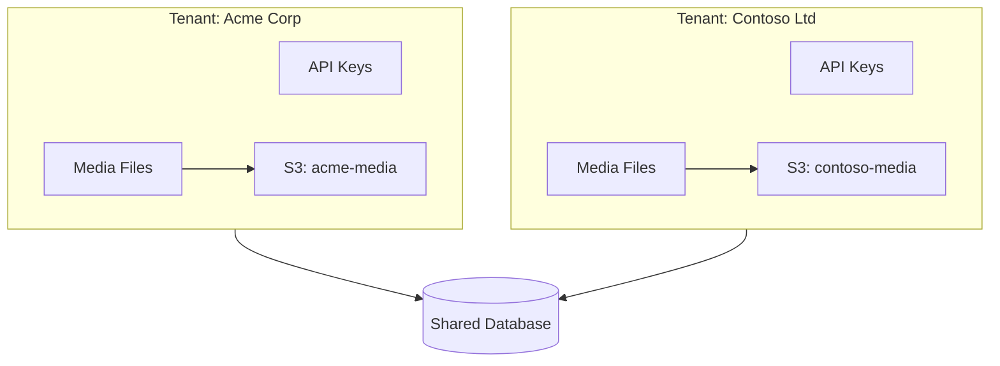

# Multi-Tenancy

Mindia is built as a multi-tenant system where each organization (tenant) has isolated data and resources. This guide explains how multi-tenancy works and how to work with it in your applications.

## Table of Contents

- [Overview](#overview)
- [Tenant Isolation](#tenant-isolation)
- [Tenant Context](#tenant-context)
- [Storage Isolation](#storage-isolation)
- [Database Isolation](#database-isolation)
- [Working with Multiple Tenants](#working-with-multiple-tenants)
- [Best Practices](#best-practices)

## Overview

In Mindia's multi-tenant architecture:

- **Tenant** = Logical tenant (organization) using Mindia
- Each tenant has its own:
  - API keys (for programmatic access)
  - Media files (images, videos, audio, documents)
  - S3 bucket (or bucket prefix)
  - Webhooks and analytics
  - Embeddings and search index

- Tenants are completely isolated:
  - API keys are scoped to a single tenant
  - API queries are automatically scoped to the authenticated tenant
  - Storage is separated by S3 bucket or prefix



## Tenant Isolation

### Automatic Scoping

All API endpoints automatically scope data to the authenticated tenant (derived from the API key or master key). You don't need to pass tenant IDs in requests.

**Example**:

```bash
# API key for Acme Corp tenant
KEY_ACME="mk_live_..."

# List images - only returns Acme Corp's images
curl https://api.example.com/api/v0/images \
  -H "Authorization: Bearer $KEY_ACME"

# API key for Contoso Ltd tenant
KEY_CONTOSO="mk_live_..."

# List images - only returns Contoso Ltd's images
curl https://api.example.com/api/v0/images \
  -H "Authorization: Bearer $KEY_CONTOSO"
```

Both requests use the same endpoint, but return different data based on the tenant.

### Tenant Context

Every authenticated request includes a tenant context derived from the API key (or master key). All database queries and storage operations are scoped to that tenant.

## Storage Isolation

Each tenant has its own S3 bucket (or bucket prefix in shared bucket mode).

### Per-Tenant Buckets (Recommended)

Each tenant is configured with a dedicated S3 bucket (via tenant configuration in the database). Storage is isolated per tenant.

**Benefits**:
- Complete storage isolation
- Per-tenant access control via IAM
- Independent lifecycle policies
- Easy data migration or deletion

**Storage Structure**:
```
acme-media/
  └── uploads/
      ├── {uuid}.jpg
      ├── {uuid}.mp4
      └── {uuid}/          # Video HLS segments
          ├── master.m3u8
          └── 720p/...

contoso-media/
  └── uploads/
      ├── {uuid}.jpg
      └── ...
```

### Shared Bucket with Prefixes (Alternative)

For simpler infrastructure, you can use a shared bucket with tenant prefixes:

```
shared-media-bucket/
  ├── tenant-{uuid-1}/
  │   └── uploads/
  │       ├── {uuid}.jpg
  │       └── ...
  └── tenant-{uuid-2}/
      └── uploads/
          ├── {uuid}.jpg
          └── ...
```

This requires code-level implementation (not currently built-in).

## Database Isolation

### Logical Isolation (Current Implementation)

Mindia uses a shared database with logical isolation:

- All tables have a `tenant_id` column
- Queries automatically filter by tenant_id
- Foreign keys enforce tenant boundaries
- Indexes include tenant_id for performance

**Example Schema**:

```sql
CREATE TABLE images (
    id UUID PRIMARY KEY,
    tenant_id UUID NOT NULL REFERENCES tenants(id),
    filename VARCHAR(255) NOT NULL,
    s3_url TEXT NOT NULL,
    -- ... other fields
    created_at TIMESTAMPTZ NOT NULL DEFAULT NOW()
);

-- Composite index for tenant-scoped queries
CREATE INDEX idx_images_tenant_created 
ON images(tenant_id, created_at DESC);

-- Ensures images belong to correct tenant
CREATE INDEX idx_images_tenant 
ON images(tenant_id);
```

### Cross-Tenant Query Prevention

The database layer prevents cross-tenant data access:

```rust
// All queries include tenant_id filter
pub async fn list_images(&self, tenant_id: Uuid) -> Result<Vec<Image>> {
    sqlx::query_as!(
        Image,
        "SELECT * FROM images 
         WHERE tenant_id = $1 
         ORDER BY created_at DESC 
         LIMIT 50",
        tenant_id
    )
    .fetch_all(&self.pool)
    .await
}
```

Even if you try to access another tenant's resource by ID, it will return "not found":

```rust
pub async fn get_image(&self, id: Uuid, tenant_id: Uuid) -> Result<Option<Image>> {
    sqlx::query_as!(
        Image,
        "SELECT * FROM images 
         WHERE id = $1 AND tenant_id = $2",  // ← Both filters required
        id,
        tenant_id
    )
    .fetch_optional(&self.pool)
    .await
}
```

## Working with Multiple Tenants

### Using Multiple Tenants

Each tenant has its own API keys (created via the API keys endpoints using the master key). Use a different API key per tenant when making requests:

```javascript
// API keys for different tenants (created via POST /api/v0/api-keys with master key)
const acmeApiKey = 'mk_live_...';   // Acme Corp tenant
const contosoApiKey = 'mk_live_...'; // Contoso Ltd tenant

// List Acme's images
const acmeImages = await fetch('/api/v0/images', {
  headers: { 'Authorization': `Bearer ${acmeApiKey}` },
}).then(r => r.json());

// List Contoso's images
const contosoImages = await fetch('/api/v0/images', {
  headers: { 'Authorization': `Bearer ${contosoApiKey}` },
}).then(r => r.json());
```

### Switching Between Tenants

Use a tenant manager that holds one API key per tenant and switches the active key for requests:

```javascript
class TenantManager {
  constructor() {
    this.keys = new Map(); // tenantId -> API key
    this.currentTenant = null;
  }

  setKey(tenantId, apiKey) {
    this.keys.set(tenantId, apiKey);
    this.currentTenant = tenantId;
  }

  switchTenant(tenantId) {
    if (!this.keys.has(tenantId)) {
      throw new Error('No API key for this tenant');
    }
    this.currentTenant = tenantId;
  }

  getCurrentKey() {
    if (!this.currentTenant) return null;
    return this.keys.get(this.currentTenant);
  }

  async apiCall(endpoint, options = {}) {
    const apiKey = this.getCurrentKey();
    return fetch(endpoint, {
      ...options,
      headers: {
        ...options.headers,
        'Authorization': `Bearer ${apiKey}`,
      },
    });
  }
}
```

### Tenant-Specific Configuration

Tenant context is derived from the API key (or master key) on each request. There is no separate "current user" or "tenant profile" endpoint; use your API key and the tenant is implied for all requests.

## Tenant Status

Tenants can have different statuses:

### Status Values

- **active**: Normal operation, all features available
- **suspended**: Temporarily disabled, API returns 401
- **deleted**: Soft-deleted, cannot be accessed

### Status Enforcement

```rust
// Checked on every request
if tenant.status != TenantStatus::Active {
    return Err(AppError::Unauthorized(
        "Tenant account is not active".to_string()
    ));
}
```

### Handling Suspended Tenants

```javascript
async function apiCall(endpoint) {
  try {
    const response = await fetch(endpoint, {
      headers: { 'Authorization': `Bearer ${token}` },
    });

    if (response.status === 401) {
      const error = await response.json();
      
      if (error.error.includes('not active')) {
        // Tenant suspended
        showTenantSuspendedMessage();
        logout();
      }
    }

    return response;
  } catch (error) {
    console.error('API error:', error);
    throw error;
  }
}
```

## Best Practices

### 1. Never Hardcode Tenant IDs

```javascript
// ❌ Bad
const images = await fetch('/api/images?tenant_id=123');

// ✅ Good - Tenant is inferred from token
const images = await fetch('/api/images', {
  headers: { 'Authorization': `Bearer ${token}` },
});
```

### 2. Validate Tenant Context on Server

If you're building a custom backend that calls Mindia:

```javascript
// Server-side validation
app.get('/my-images', async (req, res) => {
  const userTenant = req.user.tenantId; // From your auth
  
  // Call Mindia with user's token
  const mindiaToken = req.user.mindiaToken;
  const images = await fetch('https://mindia/api/images', {
    headers: { 'Authorization': `Bearer ${mindiaToken}` },
  });

  // Images are already tenant-scoped by Mindia
  res.json(await images.json());
});
```

### 3. Handle Tenant Errors Gracefully

```javascript
async function tenantSafeApiCall(endpoint) {
  try {
    const response = await authenticatedFetch(endpoint);
    
    if (response.status === 401) {
      const error = await response.json();
      
      if (error.error.includes('Tenant')) {
        // Tenant-specific error
        handleTenantError(error);
        return null;
      }
    }

    return await response.json();
    
  } catch (error) {
    console.error('API error:', error);
    return null;
  }
}

function handleTenantError(error) {
  if (error.error.includes('not active')) {
    alert('Your organization account has been suspended. Please contact support.');
  } else if (error.error.includes('not found')) {
    alert('Organization not found.');
  }
  
  // Clear session and redirect
  logout();
}
```

### 4. Use Tenant-Specific S3 Buckets

```javascript
// During registration, use unique bucket names
function generateBucketName(orgName) {
  const slug = orgName
    .toLowerCase()
    .replace(/[^a-z0-9-]/g, '-')
    .replace(/-+/g, '-')
    .substring(0, 50);
  
  const random = Math.random().toString(36).substring(2, 8);
  
  return `${slug}-media-${random}`;
}

// Example usage
const bucketName = generateBucketName('Acme Corp');
// Result: "acme-corp-media-x7k2p9"
```

### 5. Monitor Per-Tenant Usage

```javascript
// Track usage metrics (tenant is implicit from API key)
async function getTenantStats() {
  const storage = await fetch('/api/v0/analytics/storage', {
    headers: { 'Authorization': `Bearer ${apiKey}` },
  }).then(r => r.json());

  return {
    totalFiles: storage.total_files,
    totalStorageBytes: storage.total_storage_bytes,
    byContentType: storage.by_content_type,
  };
}
```

### 6. Implement Tenant Quotas (Custom)

```javascript
// Example client-side quota checking
class TenantQuotaManager {
  constructor(limits) {
    this.limits = limits; // { maxFiles, maxBytes, maxVideos }
  }

  async checkQuota(type) {
    const stats = await getTenantStats();
    
    switch(type) {
      case 'file':
        if (stats.totalFiles >= this.limits.maxFiles) {
          throw new Error('File quota exceeded');
        }
        break;
      case 'storage':
        if (stats.totalBytes >= this.limits.maxBytes) {
          throw new Error('Storage quota exceeded');
        }
        break;
    }
  }

  async uploadWithQuotaCheck(file) {
    await this.checkQuota('file');
    await this.checkQuota('storage');
    
    // Proceed with upload
    return uploadFile(file);
  }
}
```

## Security Considerations

### 1. Token Security

- Never share tokens between tenants
- Store tokens securely (httpOnly cookies preferred)
- Implement token expiration handling

### 2. Data Leakage Prevention

- Always authenticate before any API call
- Never expose tenant IDs in client URLs
- Validate tenant access server-side

### 3. Cross-Tenant Attacks

Mindia prevents:
- ✅ Cross-tenant data access via API
- ✅ Cross-tenant storage access
- ✅ Cross-tenant search results

Your application should also:
- ❌ Never cache data across tenant sessions
- ❌ Never merge data from multiple tenants in UI
- ❌ Never reuse websocket connections between tenants

## Next Steps

- [Authentication](authentication.md) - Learn about JWT tokens and login
- [Authorization](authorization.md) - Understand user roles and permissions
- [Best Practices](best-practices.md) - Security and architecture recommendations

