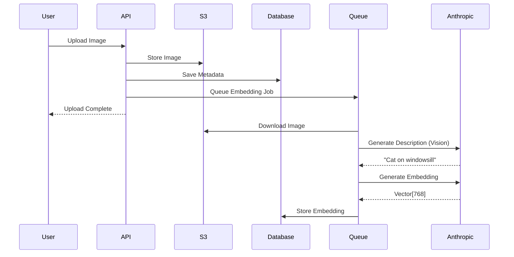
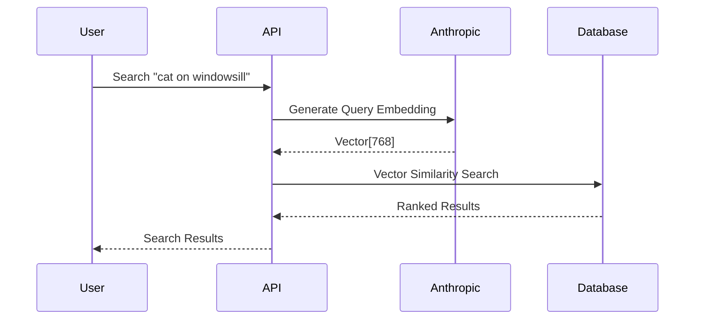

# Semantic Search

Search your media library using natural language queries powered by Anthropic (Claude) and pgvector.

## Table of Contents

- [Overview](#overview)
- [Setup](#setup)
- [Search API](#search-api)
- [How It Works](#how-it-works)
- [Search Examples](#search-examples)
- [Best Practices](#best-practices)
- [Troubleshooting](#troubleshooting)

## Overview

Mindia's semantic search allows you to find images, videos, audio, and documents using natural language descriptions rather than exact filename matches.

**Example Queries**:
- "cat sitting on windowsill"
- "sunset over ocean"
- "presentation about marketing strategy"
- "jazz music with saxophone"

**Features**:
- ✅ Natural language search
- ✅ Works across all media types
- ✅ Automatic indexing on upload
- ✅ AI-powered descriptions (images via vision model)
- ✅ Vector similarity matching

## Setup

Semantic search uses **Anthropic/Claude** or **Voyage AI** (cloud). No local models. When enabled, at least one of [Anthropic API key](https://console.anthropic.com/) or Voyage API key must be set. Claude is used for vision and document summarization; embeddings can use Anthropic or Voyage.

1. **Enable in Mindia**

```env
SEMANTIC_SEARCH_ENABLED=true
ANTHROPIC_API_KEY=your-api-key
ANTHROPIC_VISION_MODEL=claude-sonnet-4-20250514
ANTHROPIC_EMBEDDING_MODEL=embed-v3
```

2. **Optional**: Override vision or embedding model. Default embedding model is `embed-v3` (modern); use `ANTHROPIC_EMBEDDING_MODEL=embed-1` if your account only has the older model.

### Restart Mindia

```bash
# If running locally
cargo run --bin mindia-api

# If using Docker
docker-compose restart mindia
```

### Index Existing Files

If you uploaded files before enabling semantic search, generate embeddings:

```bash
cargo run --bin generate_embeddings
```

This processes all existing files and creates search indexes.

## Search API

### Endpoint

```
GET /api/v0/search
```

### Headers

```
Authorization: Bearer <token>
```
</think>
Checking the current state of the paragraph:
<｜tool▁calls▁begin｜><｜tool▁call▁begin｜>
Read’s embeddings API for vectors. When enabled, at least one of [Anthropic API key](https://console.anthropic.com/) or Voyage API key must be set. Claude is used for vision and document summarization; embeddings can use Anthropic or Voyage.

1. **Enable in Mindia**

```env
SEMANTIC_SEARCH_ENABLED=true
ANTHROPIC_API_KEY=your-api-key
ANTHROPIC_VISION_MODEL=claude-sonnet-4-20250514
ANTHROPIC_EMBEDDING_MODEL=embed-v3
```

Alternatively, use Voyage for embeddings: set `VOYAGE_API_KEY` and `VOYAGE_EMBEDDING_MODEL` (e.g. `voyage-3`). Vision/summarization still use Anthropic when configured.

2. **Optional**: Override vision or embedding model. Default embedding model is `embed-v3` (modern); use `ANTHROPIC_EMBEDDING_MODEL=embed-1` if your account only has the older model.

### Restart Mindia

```bash
# If running locally
cargo run --bin mindia-api

# If using Docker
docker-compose restart mindia
```

### Index Existing Files

If you uploaded files before enabling semantic search, generate embeddings:

```bash
cargo run --bin generate_embeddings
```

This processes all existing files and creates search indexes.

## Search API

### Endpoint

```
GET /api/v0/search
```

### Headers

```
Authorization: Bearer <token>
```

### Query Parameters

| Parameter | Type | Required | Description |
|-----------|------|----------|-------------|
| `q` | string | No* | Natural language search query (max 16 KB). *Required for semantic/combined mode unless metadata filters are used. |
| `type` | string | No | Filter by type: `image`, `video`, `audio`, `document` |
| `limit` | integer | No | Number of results to request (1-100, default: 20) |
| `offset` | integer | No | Number of results to skip for pagination (default: 0) |
| `search_mode` | string | No | `metadata`, `semantic`, or `both` (default: `both`) |
| `min_similarity` | float | No | Minimum similarity score 0.0–1.0 (default: 0.3). Results below this are excluded. |
| `folder_id` | UUID | No | Restrict results to a folder and its subfolders |

**Pagination and similarity**: Limit and offset are applied in the database; then results are filtered by `min_similarity`. So `count` in the response is the number of items *after* similarity filtering (you may get fewer than `limit`). Pagination skips rows before filtering, so "page 2" is the next `limit` rows from the full ordered set, then filtered—not the next `limit` items that pass `min_similarity`.

### Response

**Status**: `200 OK`

```json
{
  "query": "cat sitting on windowsill",
  "results": [
    {
      "id": "550e8400-e29b-41d4-a716-446655440000",
      "entity_type": "image",
      "filename": "cat-photo.jpg",
      "url": "https://bucket.s3.amazonaws.com/uploads/...",
      "description": "A fluffy orange cat sitting on a windowsill looking outside",
      "similarity_score": 0.89,
      "content_type": "image/jpeg",
      "file_size": 1048576
    },
    {
      "id": "660e9500-f30c-52e5-b827-557766551111",
      "entity_type": "image",
      "filename": "window-cat.jpg",
      "url": "https://bucket.s3.amazonaws.com/uploads/...",
      "description": "Cat resting by a window with sunlight",
      "similarity_score": 0.82,
      "content_type": "image/jpeg",
      "file_size": 2097152
    }
  ],
  "count": 2
}
```

### Examples

```bash
TOKEN="your-token"

# Search all media
curl "https://api.example.com/api/search?q=sunset+beach" \
  -H "Authorization: Bearer $TOKEN"

# Search only images
curl "https://api.example.com/api/search?q=cat&type=image&limit=10" \
  -H "Authorization: Bearer $TOKEN"

# Search videos
curl "https://api.example.com/api/search?q=person+walking&type=video" \
  -H "Authorization: Bearer $TOKEN"

# Search documents
curl "https://api.example.com/api/search?q=quarterly+report&type=document" \
  -H "Authorization: Bearer $TOKEN"
```

```javascript
async function searchMedia(query, type = null, limit = 20) {
  const token = localStorage.getItem('token');
  
  const params = new URLSearchParams({ q: query, limit: limit.toString() });
  if (type) {
    params.append('type', type);
  }

  const response = await fetch(
    `https://api.example.com/api/search?${params}`,
    {
      headers: {
        'Authorization': `Bearer ${token}`,
      },
    }
  );

  return await response.json();
}

// Usage
const results = await searchMedia('cat sitting on windowsill', 'image');
console.log('Found:', results.count, 'images');
results.results.forEach(result => {
  console.log(`${result.filename}: ${result.similarity_score.toFixed(2)} match`);
});
```

## How It Works

### Upload Flow



### Search Flow



### Content Processing

**Images**:
1. Image sent to Claude vision model
2. Model generates natural language description
3. Description converted to embedding vector
4. Vector stored in pgvector database

**Videos**:
1. First frame extracted from video
2. Frame sent to vision model
3. Description generated and embedded
4. Vector stored for searching

**Audio & Documents**:
1. Metadata or text content extracted
2. Text summarized if needed
3. Embedding generated from text
4. Vector stored

### Vector Similarity

Mindia uses **cosine similarity** to find matching content:

- Score range: 0.0 to 1.0
- Higher scores = more similar
- Typical relevant results: > 0.3
- Formula: `1 - (embedding <=> query_embedding)`

## Search Examples

### React Search Component

```tsx
import { useState } from 'react';

function MediaSearch() {
  const [query, setQuery] = useState('');
  const [results, setResults] = useState([]);
  const [loading, setLoading] = useState(false);
  const [filter, setFilter] = useState('all');

  async function handleSearch(e) {
    e.preventDefault();
    if (!query.trim()) return;

    setLoading(true);
    try {
      const type = filter === 'all' ? null : filter;
      const data = await searchMedia(query, type);
      setResults(data.results);
    } catch (error) {
      console.error('Search failed:', error);
    } finally {
      setLoading(false);
    }
  }

  return (
    <div className="media-search">
      <form onSubmit={handleSearch}>
        <input
          type="text"
          value={query}
          onChange={(e) => setQuery(e.target.value)}
          placeholder="Search for images, videos, documents..."
        />
        
        <select value={filter} onChange={(e) => setFilter(e.target.value)}>
          <option value="all">All Media</option>
          <option value="image">Images</option>
          <option value="video">Videos</option>
          <option value="audio">Audio</option>
          <option value="document">Documents</option>
        </select>

        <button type="submit" disabled={loading}>
          {loading ? 'Searching...' : 'Search'}
        </button>
      </form>

      <div className="search-results">
        {results.map(result => (
          <div key={result.id} className="result-item">
            
            <div className="result-info">
              <h3>{result.filename}</h3>
              <p>{result.description}</p>
              <span>Match: {(result.similarity_score * 100).toFixed(0)}%</span>
            </div>
          </div>
        ))}
      </div>
    </div>
  );
}

function getThumbUrl(result) {
  if (result.entity_type === 'image') {
    return result.url.replace('/uploads/', `/api/images/${result.id}/-/resize/200x/`);
  }
  return `/icons/${result.entity_type}.png`;
}
```

### Search with Filters

```javascript
async function advancedSearch({
  query,
  mediaTypes = ['image', 'video', 'audio', 'document'],
  minScore = 0.3,
  limit = 50,
}) {
  const results = [];

  for (const type of mediaTypes) {
    const data = await searchMedia(query, type, limit);
    const filtered = data.results.filter(r => r.similarity_score >= minScore);
    results.push(...filtered);
  }

  // Sort by score descending
  results.sort((a, b) => b.similarity_score - a.similarity_score);

  return results.slice(0, limit);
}

// Usage
const results = await advancedSearch({
  query: 'nature photography',
  mediaTypes: ['image', 'video'],
  minScore: 0.5,
  limit: 20,
});
```

## Best Practices

### 1. Write Good Search Queries

```javascript
// ✅ Good: Descriptive, natural language
"red sports car parked in front of building"
"person giving presentation to audience"
"jazz music with piano solo"

// ❌ Bad: Too vague or single words
"car"
"presentation"
"music"

// ✅ Good: Specific details
"black and white photo of vintage camera"
"tutorial video about web development"

// ❌ Bad: Technical jargon
"IMG_1234.jpg"
"video_720p_h264.mp4"
```

### 2. Filter by Media Type

```javascript
// Search specific types for better performance
const images = await searchMedia('sunset', 'image');
const videos = await searchMedia('tutorial', 'video');
const docs = await searchMedia('report', 'document');
```

### 3. Handle Low Scores

```javascript
async function intelligentSearch(query) {
  const results = await searchMedia(query);
  
  const highQuality = results.results.filter(r => r.similarity_score > 0.7);
  const mediumQuality = results.results.filter(r => 
    r.similarity_score > 0.4 && r.similarity_score <= 0.7
  );

  if (highQuality.length > 0) {
    return { results: highQuality, quality: 'high' };
  } else if (mediumQuality.length > 0) {
    return { results: mediumQuality, quality: 'medium' };
  } else {
    return { results: [], quality: 'none', message: 'No relevant results found' };
  }
}
```

### 4. Debounce Search Input

```javascript
import { useState, useEffect } from 'react';

function useDebounce(value, delay) {
  const [debouncedValue, setDebouncedValue] = useState(value);

  useEffect(() => {
    const handler = setTimeout(() => {
      setDebouncedValue(value);
    }, delay);

    return () => clearTimeout(handler);
  }, [value, delay]);

  return debouncedValue;
}

function SearchBox() {
  const [query, setQuery] = useState('');
  const debouncedQuery = useDebounce(query, 500);
  const [results, setResults] = useState([]);

  useEffect(() => {
    if (debouncedQuery) {
      searchMedia(debouncedQuery).then(data => setResults(data.results));
    }
  }, [debouncedQuery]);

  return (
    <input
      type="text"
      value={query}
      onChange={(e) => setQuery(e.target.value)}
      placeholder="Search..."
    />
  );
}
```

### 5. Cache Search Results

```javascript
class SearchCache {
  constructor(ttl = 300000) { // 5 minutes
    this.cache = new Map();
    this.ttl = ttl;
  }

  get(query, type) {
    const key = `${query}:${type || 'all'}`;
    const cached = this.cache.get(key);
    
    if (cached && Date.now() - cached.timestamp < this.ttl) {
      return cached.data;
    }

    return null;
  }

  set(query, type, data) {
    const key = `${query}:${type || 'all'}`;
    this.cache.set(key, {
      data,
      timestamp: Date.now(),
    });
  }
}

const searchCache = new SearchCache();

async function cachedSearch(query, type) {
  const cached = searchCache.get(query, type);
  if (cached) return cached;

  const results = await searchMedia(query, type);
  searchCache.set(query, type, results);
  return results;
}
```

## Troubleshooting

### No Search Results

**Problem**: Search returns no results even though files exist.

**Solutions**:
1. Check if semantic search is enabled:
   ```bash
   curl http://localhost:3000/api/config | grep semantic
   ```

2. Verify `ANTHROPIC_API_KEY` is set and valid.

3. Check if embeddings exist:
   ```sql
   SELECT COUNT(*) FROM embeddings;
   ```

4. Generate embeddings for existing files:
   ```bash
   cargo run --bin generate_embeddings
   ```

### Slow Search Performance

**Problem**: Searches take too long.

**Solutions**:
1. Add vector index (if not present):
   ```sql
   CREATE INDEX idx_embeddings_vector 
   ON embeddings USING ivfflat (embedding vector_cosine_ops);
   ```

2. Reduce search limit:
   ```javascript
   await searchMedia(query, type, 10); // Instead of 50
   ```

3. Filter by media type to narrow search space

### Anthropic API Errors

**Problem**: "Failed to connect to Anthropic" or API key errors.

**Solutions**:
1. Verify `ANTHROPIC_API_KEY` is set and valid in your environment.
2. Check [Anthropic console](https://console.anthropic.com/) for usage limits and API status.
3. Check firewall/network settings for outbound HTTPS.

### Inaccurate Results

**Problem**: Search results don't match query well.

**Solutions**:
1. Use more descriptive queries
2. Try different phrasing
3. Filter by specific media type
4. Override to a larger vision model if needed: `ANTHROPIC_VISION_MODEL=claude-sonnet-4-20250514`

## Next Steps

- [Images](images.md) - Image management
- [Videos](videos.md) - Video streaming
- [Audio](audio.md) - Audio files
- [Documents](documents.md) - PDF documents
- [API Reference](api-reference.md) - Complete API docs

